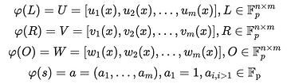

# QAP - Quadratic Arithmetic Programs

A QAP is a system of equations chere the coefficients are monovariate polynomials and a valid
solution results in a single polynomial equality.
They are quadratic because they have exactly one polynomial multiplication.
QAP allow zk-SNARKs to be succint!

An R1CS evaluation is not succint due to many matrix multiplications.

Due to Schwartz-Zippel Lemma, polynomials allow us to make statements succinct.
In a sense, we can compress a polynomial down to a single point.
Key idea is:
1. Operations in R1CS form an algebraic ring
2. Polynomials under addition and multiplication are rings
3. There exists an easily computable homomorphism from R1CS to polynomials

Once we have a monovariate polynomial statement with only one polynomial equality, we can evaluate it succinctly.

## Schartz-Zippel Lemma
If two polynomials are randomly evaluated at a same $x$ value, and their value $y$ is the same, then one can be nearly certain that they are the same polynomial.

$\tau$ random, if $P_1(\tau) == P_2(\tau)$ then $P1 == P2$. This is what make the succinctness. Comparing coefficients of poly would be far less efficient.

We already how to make the R1CS evaluation ZK (see [Zero Knowledge Proofs with Rank 1 Constraint Systems](../zkp-with-r1cs/README.md)). We need to make it succinct.

Let's say I have a $poly$ transformation, and a $\tau$ random value.
- $u=poly(Ls)(\tau)$
- $v=poly(Rs)(\tau)$
- $w=poly(Os)(\tau)$

By SZ-LM, if $uv = w$, the polynomials are the same, then $Ls \odot Rs = Os$.

Better, we turn $u$, $v$, and $w$ into $[U],[V],[W]$ EC points to hide their values. Verifier pairs $[U]$ and $[V]$ and compares result to $[W]$, so we have ZK.

## Transform R1CS into a single polynomial
### Recalls
We need to know:
- Rings (see [ring section](../rings-and-fields/README.md))

### Rings
R1CS is a ring, as it has:
- operator: addition
- identity: all vector zero
- inverse: vector with elements multiplied by -1
- operator: multiplication (hadamard product)
- inverse: no inverse for multiplication

Polynomials are also a ring, it has:
- operator: addition
- identity: zero polynomial $(0x^0)$
- inverse: polynomial with coefficients of opposite sign
- operator: multiplication
- inverse: no inverse for multiplication

### Ring homomorphism
Theorem: There exists a ring homomorphism from columns vectors of dimension $n$ with real numbers elements to polynomials with real coefficients.

### Polynomials
We need to think polynomial as an infinite set of pairs (x,y) instead of $a = ax^2 + bx + c$.

If we want to add two polynomials, we need to define the relation that combines those two sets of pairs: cartestian product.
Let's define $P1$ and $P2$, and their cartesian product $P1 \times P2$.
An element in the cartesian product will look like $((x_1, y_1), (x_2, y_2))$.
We select the subset of our cartesian product where $x_1 = x_2$.
Then, we produce the pair $(x, y_1 + y_2)$.

We are combining matching paies of values from two polynomials (cartesian product), adding their $y$ values together
and making a new pair with the shared $x$ value and summed $y$ value.

Graphically, it corresponds to drawing a vertical line at $x$, adding the $y$ values of the two polynomials
and then drawing a new curve with the $y_{sum}$ value.
The form of the new curve will have the same $y=ax^2 + bx + c$ form.

When we add (or do a Hadamard product) two vectors, we are doing the same thing: combining a set of points according
to a rule defined in our set relation.
The only difference is that vector has finite points and polynomial has infinite points.

### Computing the transformation function for the homomorphism
A polynomial is an infinite amount of points, while a n-dimensional vector only encodes a finite number of points (which is n).
To make them fit, we decide on $n$ predetermined values of $x$ whose $y$ values will represent the elements
of the original vector.

Theorem: Given $n$ points on a cartesian $(x,y)$ plane, they can be *uniquely* interpolated by a polynomial of degree $n-1$. 
If the degree isn't constrained, an infinite number of polynomials of degree $n-1$ or higher can interpolate those points.

Example: A single point can be uniquely interpolated by a vertical line (a polynomial of degree zero). Two points can be uniquely interpolated by a straight line (a polynomial of degree one). This holds for all larger degrees.

In summary, a vector can be conceptualized as a set of pairs where the first entry is the dimension and the second entry is the value.

#### Example - Lagrange interpolation
Let's say $n=3$. We choose the 3 $x$ coordinates to encode the vector, let's say $x=1, x=2, x=3$.
If we want to encode the vector $[4, 12, 6]$, we need a polynomial resulting in the following pairs:
$(1, 4), (2, 12), (3, 6)$.

To obtain the associated polynomials, there are multiple algorithms. One of the most used is Lagrange interpolation.

The [lagrange-interpolation.py](./lagrange-interpolation.py) python script shows the solution to our example.

### Examples

#### Addition homomorphism

The [addition-homomorphism.py](./addition-homomorphism.py) python script shows the homomorphism of addition between two vectors and two polynomials.

#### Hadamard product homomorphism

The [hadamard-homomorphism.py](./hadamard-homomorphism.py) python script shows the homomorphism of hadamard product between two vectors and two polynomials.

#### Scalar multiplication homomorphism

The [scalar-homomorphism.py](./scalar-homomorphism.py) python script shows the homomorphism of scalar multiplication between two vectors and two polynomials.

### R1CS: A * B = C

When doing $Ls \odot Rs = Os$, we are doing $Ls$ which is the dot product of each of the rows of $L$ with $s$.

If $Ls \odot Rs = Os$ can be computed with vector arithmetic, then it can also be computed with polynomial arithmetics.

To compute $Ls, Rs, Os$, we do a scalar multiplication on each column of $L, R, S$ with the appropriate scalar value from vector $s$.
We then use Lagrange interpolation to convert all the colums in each of the matric into polynomials,
and then add them up all together to get a polynomial.
**Each columns of each matrix is turned into a polynomial. Column 1 of matrix $L$ will give polynomial $u_1(x)$.** 

$ToPoly(Ls) = U(x)$, $ToPoly(Rs) = V(x)$ and $ToPoly(Os) = W(x)$ are the three resulting polynomials.
Because of homomorphism, $U(x) V(x) = W(x)$. Here our R1CS circuit is written as a single expression!

**IMPORTANT: Polynomials are encoding the exact same informations as the R1CS.
Polynomial addition and multiplication may feel different than operations on matrics,
it should not bother us as this is a ring homomorphism.
Information transformations will be consistent!**

## QAP
### Notation

The transformation done to get polynomials from matrices can be called $\phi$.
The following notation should now be easily understandable:

*Note: the witness vector $s$ is also transformed as a polynomial $a$.*

### Initial transform

When our R1CS matrics $L, R, O$ are written as polynomials, we have a **Quadratic Arithmetic Program**.

As $U, V, W$ are vectors of polynomials of length $m$, and the witness $a$ is of length $m$, dot product is used to combine them: $(U \cdot a) ( V \cdot a ) = W \cdot a$

This can also be written as: $\sum\limits_{i=0}^{m} a_i u_i(x) \sum\limits_{i=0}^{m} a_i v_i(x) = \sum\limits_{i=0}^{m} a_i w_i(x)$

### $U \cdot a$ Notation
Only the prover can do this dot product because he know the witness $a$.

$(U \cdot a) = (u_1(x), u_2(x), ..., u_m(x)) \cdot (a_1(x), a_2(x), ..., a_m(x)) = a_1 u_1 (x) + a_2 u_2 (x) + ... + a_m u_m (x)$

This expression evaluates to a single monovariate polynomial.
The only indeterminate is $x$, because all values $a$ are known to the proved.

### QAP balancing

Our QAP which can be written as $\sum\limits_{i=0}^{m} a_i u_i(x) \sum\limits_{i=0}^{m} a_i v_i(x) = \sum\limits_{i=0}^{m} a_i w_i(x)$ will not be equal to each other.
The left term of the equation will in general have twice the degree of the polynomial on the right due to the multiplication.

We need to add a *balancing term*. This will be a polynomial added to $W \cdot a$.

This polynomial allow to get the same degree on both size of the equation.
In fact, in the R1CS world we are doing $Ls \odot Rs = Os + 0$.

#### Example
Let's say $U \cdot a = x^2 + x + 1$ and $V \cdot a = 3 x^2 - 2x + 1$.

When multiplying $U \cdot a$ and $V \cdot a$,
we get $(U \cdot a)(V \cdot a) = 3 x^4 + x^3 + 2 x^2 -x + 1$.

But transforming $W \cdot a$ would give a polynomial of degree 2.
We can preserve the equality that interpolates zero at $x = 1,2,3,4$.

In fact, in the R1CS world we are doing $Ls \odot Rs = Os + 0$.
It is valid for $\phi (0)$ to be a polynomial of degree $4$.

#### Computing the zero polynomial
The *balancing term* is a zero polynomial at the points we need to evaluate it.
It can be represented as the product of two polynomials: $h(x)$ and $t(x)$

The target polynomial $t(x)$ needs to be zero at the point we evaluate.
If those points are $x = 1, 2, 3$, then $t(x) = (x-1)(x-2)(x-3)$.

This polynomial $t(x)$ is not secret and is constructed during the trusted setup phase
of the zero knowledge circuit.

But $t(x)$ could not be sufficient to balance the equation $(U \cdot a)(V \cdot a) = (W \cdot a) + t(x)$.
Theorem: *When two non-zero polynomials are multiplied,
the roots of the product is the union of the roots of the individual polynomials.*
So, we can multiply $t(x)$ by anything except zero and it will still correspond
to the zero vector in R1CS land.

What we need to resolve now is:
$$ \frac{(U \cdot a)(V \cdot a) - (W \cdot a)}{t(x)} = h(x)$$

So, our final calculation is $(U \cdot a)(V \cdot a) = (W \cdot a) + t(x) h(x)$.
It can also be written as $\sum\limits_{i=0}^{m} a_i u_i(x) \sum\limits_{i=0}^{m} a_i v_i(x) = \sum\limits_{i=0}^{m} a_i w_i(x) + h(x)t(x)$.

#### More context
The fact that $t(x)$ is a public polynomial matters.
The prover is forced to compute an $h(x)$ that interpolates zero at $x=1,2,3$.
Otherwise, the prover might pick polynomial that satifies the equation but
doesn't correspond to the R1CS.

### Back to Schwartz-Zippel

So we have two polynomials:
- $(U \cdot a)(V \cdot a)$
- $(W \cdot a) + t(x) h(x)$

The ZK trusted setup computes some points:
$[xG], [x^2 G], [x^3 G], ..., [x^n G]$

The prover computes the polynomials $(U \cdot a)$, $(V \cdot a)$, $(W \cdot a)$ and $h(x)$ by multiplying those elliptic curve points with their polynomial coefficients.

*Note: In the following lines, [P] describes elliptic curves points.*

For $U \cdot a$, we have:
$$[A] = (U \cdot a)(x) = u_d(x^d) + u_{d-1}(x^{d-1}) + ... + u_1(x) + u_0$$
$$[A] = u_d(x^d G) + u_{d-1}(x^{d-1} G) + ... + u_1(x G) + u_0 G$$

For $V \cdot a$, we have:
$$[B] = (V \cdot a)(x) = v_d(x^d) + v_{d-1}(x^{d-1}) + ... + v_1(x) + v_0$$
$$[B] = v_d(x^d G) + v_{d-1}(x^{d-1} G) + ... + v_1(x G) + v_0 G$$

For $W \cdot a$, we have:
$$[C'] = (W \cdot a)(x) = w_d(x^d) + w_{d-1}(x^{d-1}) + ... + w_1(x) + w_0$$
$$[C'] = w_d(x^d G) + w_{d-1}(x^{d-1} G) + ... + w_1(x G) + w_0 G$$

For $h(x)t(x) = ht(x)$, we have:
$$[HT] = ht(x) = ht_d(x^d) + ht_{d-1}(x^{d-1}) + ... + ht_1(x) + ht_0$$
$$[HT] = ht_d(x^d G) + ht_{d-1}(x^{d-1} G) + ... + ht_1(x G) + ht_0 G$$

Then, we can set $[C] = [C'] + [HT]$.

Finally, the verifier computes $pairing([A], [B]) = [C]$.
If it checks out, then the prover has a valid witness.

This works because $[A], [B], [C]$ represent the polynomials evaluated at a random point,
and polynomial equality can be checked at a single point with Schwartz-Zippel.

### Important details
In the current construction, the prover can just invent values.
He could have taken $a, b$, computes $c=ab$ and the computes $[A] = aG$,
$[B] = bG$ and $[C] = cG$.

To avoid this, Groth16 has extra parameters in it.
In tornado cash, those are defined as $\alpha, \beta, \gamma, \delta$.
They are encrypted values from the trusted setup.
They force the prover to be honest.

## Real example of QAP
### Initial state
We have the equation $out = x_1^2 + 4 x_2^2 x_1 -2$.

### Constraints
We obtain the following quadratic constraints:
$$x_3 = x_1 x_1$$
$$x_4 = x_2 x_2$$
$$out - x3 + 2 = 4x_4 x_1$$

### R1CS

The witness vector will be $[1, out, x_1, x_2, x_3, x_4]$.

Our matrices $L, R, O$ are:
$$L = \begin{bmatrix}0 & 0 & 1 & 0 & 0 & 0 \\ 0 & 0 & 0 & 1 & 0 & 0 \\ 0 & 0 & 0 & 0 & 0 & 4\end{bmatrix}$$
$$R = \begin{bmatrix}0 & 0 & 1 & 0 & 0 & 0 \\ 0 & 0 & 0 & 1 & 0 & 0 \\ 0 & 0 & 1 & 0 & 0 & 0\end{bmatrix}$$
$$O = \begin{bmatrix}0 & 0 & 0 & 0 & 1 & 0 \\ 0 & 0 & 0 & 0 & 0 & 1 \\ 2 & 1 & 0 & 0 & -1 & 0\end{bmatrix}$$

### Homomorphism transformation
For each column of each matrix, we will do the transformation.
Only the first column of $L$ that contains a value will be detailed here.

